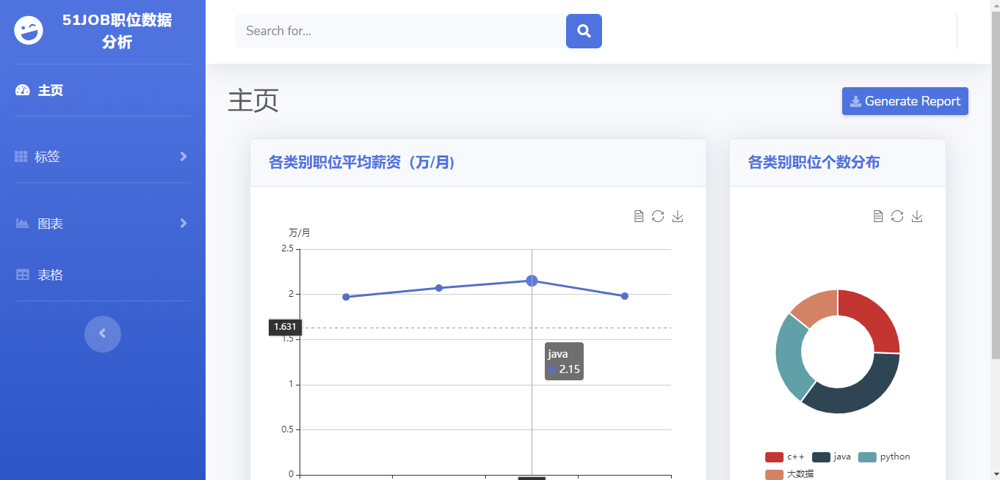
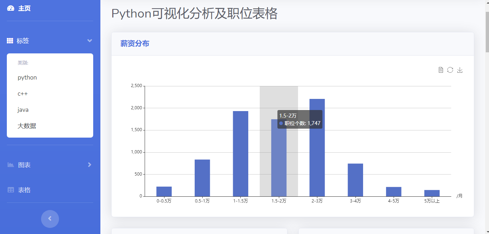
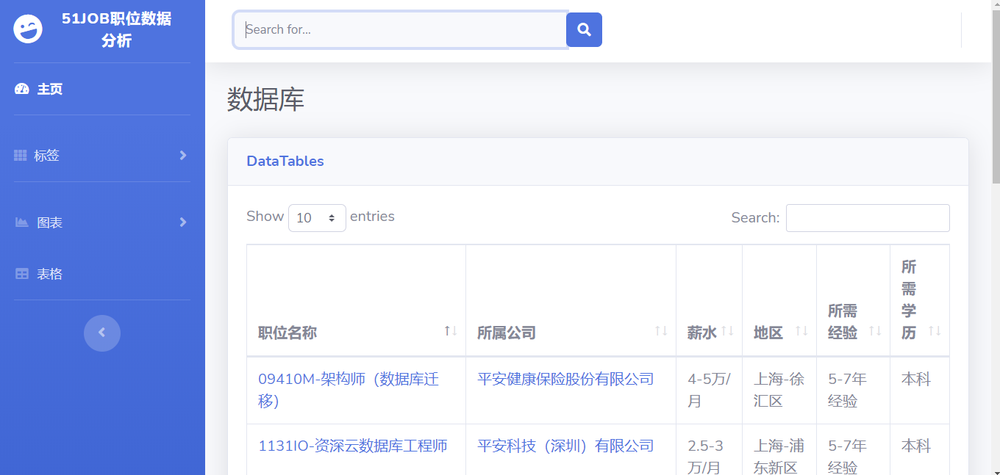
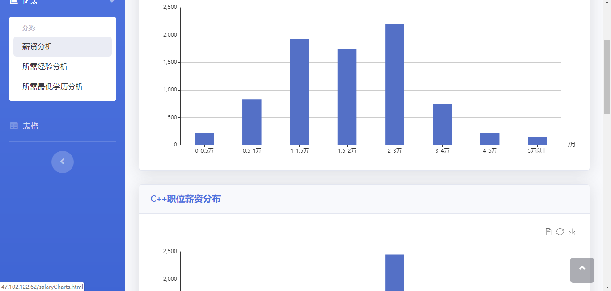

# 51jobAnalysis
使用Python爬虫，sqlite存储数据，Flask框架和Echarts并对网上下载的网站模板进行修改实现的web小应用，爬取了前程无忧上海地区python、c++、java、大数据的招聘岗位，并进行可视化分析

使用方法
创建虚拟环境`python -m venv .venv`，进入虚拟环境安装，`pip install -r requirements.txt`，运行app.py文件

网站可以对岗位名字的关键字进行搜索，也可以直接点击相关标签查看信息

>首页

>标签页

>搜索页

>图表页

